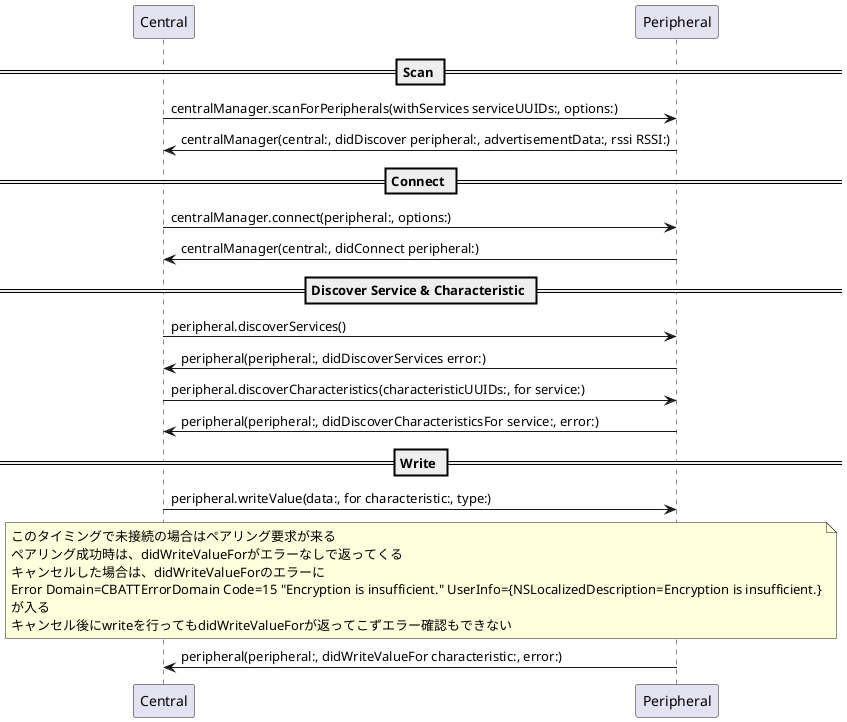

# iOS BLE Secure Connect

```plantuml
@startuml connect device

participant Central as CE
participant Peripheral as PE

== Scan ==
CE -> PE: centralManager.scanForPeripherals(withServices serviceUUIDs:, options:)
CE <- PE: centralManager(central:, didDiscover peripheral:, advertisementData:, rssi RSSI:)

== Connect ==
CE -> PE: centralManager.connect(peripheral:, options:)
CE <- PE: centralManager(central:, didConnect peripheral:)

== Discover Service & Characteristic ==

CE -> PE: peripheral.discoverServices()
CE <- PE: peripheral(peripheral:, didDiscoverServices error:) 
CE -> PE: peripheral.discoverCharacteristics(characteristicUUIDs:, for service:)
CE <- PE: peripheral(peripheral:, didDiscoverCharacteristicsFor service:, error:)

== Write ==

CE -> PE: peripheral.writeValue(data:, for characteristic:, type:)
note over CE, PE: このタイミングで未接続の場合はペアリング要求が来る\nペアリング成功時は、didWriteValueForがエラーなしで返ってくる\nキャンセルした場合は、didWriteValueForのエラーに\nError Domain=CBATTErrorDomain Code=15 "Encryption is insufficient." UserInfo={NSLocalizedDescription=Encryption is insufficient.}\nが入る\nキャンセル後にwriteを行ってもdidWriteValueForが返ってこずエラー確認もできない
CE <- PE: peripheral(peripheral:, didWriteValueFor characteristic:, error:)

@enduml
```
